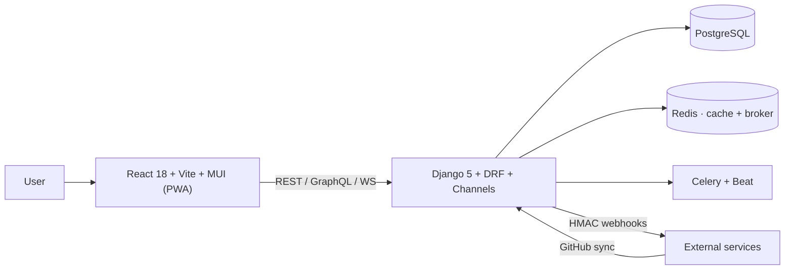

<h1 align="center">TODOlist</h1>

<p align="center">
  <strong>Self-hosted, open-source work management (AGPLv3)</strong><br>
  Tasks, projects, sprints, OKRs, wiki, SLA automations,<br>
  offline sync with field-level conflict merge, and optional client-side E2EE.
</p>

<p align="center">
  <a href="https://github.com/ToDoSolutions/TODOlist/actions/workflows/ci.yml">
    
  </a>
  <a href="./LICENSE">
    
  </a>
  
  
</p>

<p align="center">
  <a href="./README.md">Español</a> ·
  <a href="#quick-start">Quick start</a> ·
  <a href="./docs/ARCHITECTURE.md">Architecture</a> ·
  <a href="./CONTRIBUTING.md">Contributing</a> ·
  <a href="./SECURITY.md">Security</a>
</p>

<p align="center">
  
</p>
<table align="center">
<tr>
  <td></td>
  <td></td>
  <td></td>
</tr>
<tr>
  <td></td>
  <td></td>
  <td></td>
</tr>
<tr>
  <td></td>
  <td></td>
  <td></td>
</tr>
</table>
<p align="center"><sub>Dashboard · Tasks · Sprints · Calendar · Task detail · Gantt · My Work · Automations · Projects</sub></p>

<details>
<summary>All screenshots — 82 screens grouped by domain</summary>

### Home and inboxes

| Home | Inbox |
|---|---|
|  |  |

| Attention inbox | Focus |
|---|---|
|  |  |

| Productivity | |
|---|---|
|  | |

### Tasks and views

| Editable table | Dependencies |
|---|---|
|  |  |

| Custom fields | Tags |
|---|---|
|  |  |

| Favorites | Completed |
|---|---|
|  |  |

| Trash | Backlog |
|---|---|
|  |  |

| Recurrence rules | Time entries |
|---|---|
|  |  |

| Import / export | |
|---|---|
|  | |

### Project and planning

| Project | Project tasks |
|---|---|
|  |  |

| Project settings | Risks |
|---|---|
|  |  |

| Portfolios | Templates |
|---|---|
|  |  |

| Epics | Roadmap |
|---|---|
|  |  |

| Burndown | Capacity |
|---|---|
|  |  |

| Dashboards | OKRs |
|---|---|
|  |  |

| Decisions | Meetings |
|---|---|
|  |  |

| Whiteboards | Wiki |
|---|---|
|  |  |

| Changelog | |
|---|---|
|  | |

### Collaboration and integrations

| Teams | Invitation |
|---|---|
|  |  |

| Share links | Public view |
|---|---|
|  |  |

| Intake forms | Public intake |
|---|---|
|  |  |

| GitHub | Integrations |
|---|---|
|  |  |

| Webhooks | API keys |
|---|---|
|  |  |

| Notifications | Search |
|---|---|
|  |  |

| Help | |
|---|---|
|  | |

### Account, security and sync

| Account | Profile |
|---|---|
|  |  |

| Security | E2E encryption |
|---|---|
|  |  |

| Offline sync | Session expired |
|---|---|
|  |  |

| Suspended account | Activity |
|---|---|
|  |  |

| Audit | |
|---|---|
|  | |

### Administration

| Admin panel | Jobs |
|---|---|
|  |  |

| Organizations | Roles |
|---|---|
|  |  |

| SLA policies | Feature flags |
|---|---|
|  |  |

### Access and states

| Login | Register |
|---|---|
|  |  |

| Password recovery | Reset |
|---|---|
|  |  |

| Verify email | Onboarding |
|---|---|
|  |  |

| 403 | 404 |
|---|---|
|  |  |

### AI assistant

| | |
|---|---|
|  |  |

| Workflows | |
|---|---|
|  | |

</details>

> **Note** — The UI ships in Spanish and English; these screenshots show the
> Spanish build. Switch language in Account → Preferences.

---

## What is it

TODOlist is for teams and individuals who want serious work management
**without handing over their data**: the server only sees ciphertext on
encrypted tasks, everything is self-hosted single-node, and every write
channel (REST, GraphQL, CalDAV, MCP, offline sync, GitHub, automations)
goes through the same authorization boundary.

See [docs/SCOPE.md](./docs/SCOPE.md) for what it does — and explicitly
does **not** do (no video calls, no marketplace, no multi-region).

## Project status

> [!NOTE]
> Functional beta. The data model and REST API are stable; GraphQL and
> offline sync may receive compatible changes documented in
> `CHANGELOG.md`. Production supported via Docker Compose/K8s/Helm.

## Quick start

Requirements: Docker + Docker Compose.

```bash
cp .env.example .env
docker compose up --build
```

| URL | What |
|---|---|
| <http://localhost:5173> | Frontend |
| <http://localhost:8000/api/docs/> | Swagger UI (OpenAPI) |
| <http://localhost:8000/graphql/> | GraphQL |
| <http://localhost:8000/admin/> | Django admin |

Demo data (opt-in): `SEED_DEV=1 docker compose up --build`.

## Features

- **Full tasks** — subtasks, comments, attachments, dependencies with
  cycle detection, recurrence, estimates, time tracking.
- **Views** — list, Kanban with WIP limits, editable table, calendar,
  Gantt/roadmap, flow-KPI dashboards.
- **Real agility** — sprints with capacity/burndown, story points,
  estimated-vs-actual velocity, DORA metrics.
- **Collaboration** — organizations, teams, granular roles, mentions,
  invitations, wiki with revisions, public intake forms.
- **Automation** — trigger/condition/action rules, SLA policies with
  escalation, outbound HMAC webhooks, Slack/Discord integrations.
- **GitHub integration** — App OAuth, bidirectional sync, PRs/commits/
  releases/check-runs linked to tasks.
- **Public API** — REST (OpenAPI + contract testing), GraphQL with
  depth limiting, WebSockets, CalDAV/iCal, MCP server, scoped API keys.
- **Privacy** — opt-in E2EE (AES-GCM + RSA-OAEP per device; the server
  never sees plaintext), offline sync with per-field merge.
- **Security** — TOTP 2FA + backup codes, per-org SAML/SCIM SSO,
  exportable audit log, per-scope rate limiting.

Per-feature detail and maturity level: [docs/MATURITY.md](./docs/MATURITY.md).

## Architecture



Every write channel converges on `apps/tasks/services.py` +
`for_user(write=True)` — the single authorization boundary
([ADR-001](./docs/decisions/ADR-001-permissions-model.md),
[ADR-004](./docs/decisions/ADR-004-multi-channel-parity.md)).

Full stack and rationale: [docs/ARCHITECTURE.md](./docs/ARCHITECTURE.md).

## Configuration

All variables documented in [`.env.example`](./.env.example).
These **fail at startup** if missing in production: `DJANGO_SECRET_KEY`,
`DATA_ENCRYPTION_KEYS`, `POSTGRES_*`. `FEATURE_*` flags act as kill
switches by URL prefix (`/api/ai/*`, `/api/sync/*`, E2EE).

## Structure

```text
backend/    Django + DRF + Celery + Channels (14 apps, ~50 models)
frontend/   React + Vite + MUI + TanStack Query (PWA)
docs/       SCOPE · ARCHITECTURE · decisions/ · operations/ · security/
deploy/     Helm + K8s + Terraform
integrations/n8n-nodes-todolist/   n8n plugin
```

## Verification

```bash
# Backend — 2,826 tests (pytest, ~12 min with -n 8)
cd backend && python -m pytest tests/ -n 8 -q

# Frontend — 145 vitest tests + typecheck + lint
cd frontend && npx vitest run && npx tsc --noEmit && npx eslint src
```

CI also runs: ruff + bandit, contract testing (schemathesis),
pip-audit + npm audit, gitleaks, markdownlint + link check,
Docker builds and OpenSSF Scorecard.

## Documentation

- **Use/operate**: [docs/operations/](./docs/operations/) — SLO/SLI,
  incidents, backup-restore, PRR, risk register, quarterly review.
- **Develop**: [AGENTS.md](./AGENTS.md) (commands + decisions) ·
  [docs/GOLDEN_PATHS.md](./docs/GOLDEN_PATHS.md) ·
  [docs/decisions/](./docs/decisions/) (ADRs) ·
  [docs/DEPENDENCIES.md](./docs/DEPENDENCIES.md).
- **Governance**: [docs/QUALITY.md](./docs/QUALITY.md) ·
  [docs/TECH_DEBT.md](./docs/TECH_DEBT.md) ·
  [docs/DEPRECATION.md](./docs/DEPRECATION.md).
- **Security/data**: [docs/security/e2ee-threat-model.md](./docs/security/e2ee-threat-model.md) ·
  [docs/PRIVACY.md](./docs/PRIVACY.md) ·
  [docs/architecture/failure-modes.md](./docs/architecture/failure-modes.md).

## Known limitations

- Single-node self-hosted — no multi-region scaling.
- E2EE content is not searchable nor visible to the AI assistant (by
  design; see the [threat model](./docs/security/e2ee-threat-model.md)).
- No signed releases or published SBOM yet (TD-008 — activates on the
  first public release).
- E2EE without a private-key backup = unrecoverable data.

Full register with priorities: [docs/TECH_DEBT.md](./docs/TECH_DEBT.md).

## Contributing

[`CONTRIBUTING.md`](./CONTRIBUTING.md) — setup, Definition of Done/Ready,
reviewer checklist. Good entry point: the recipes in
[docs/GOLDEN_PATHS.md](./docs/GOLDEN_PATHS.md).

## Security

**Do not open a public issue** for vulnerabilities — private process in
[`SECURITY.md`](./SECURITY.md) (GitHub Security Advisories).

## License

[AGPLv3](./LICENSE).
