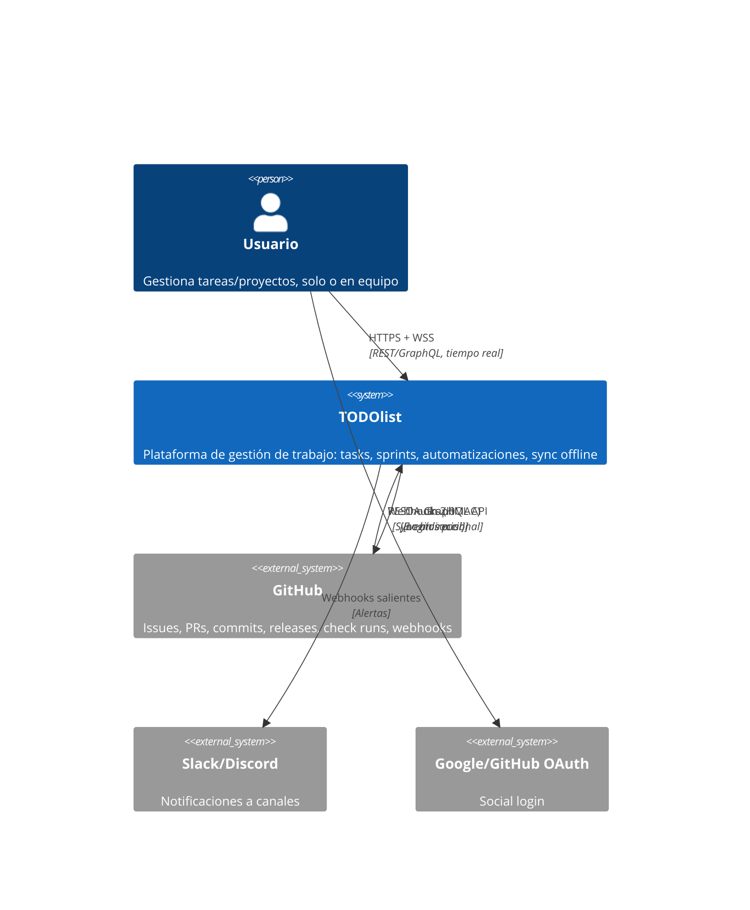
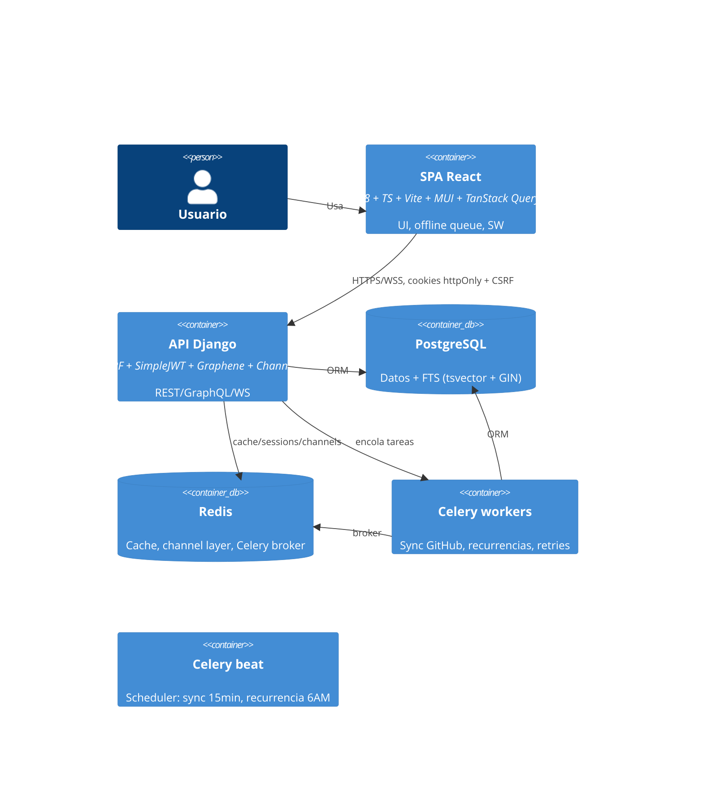
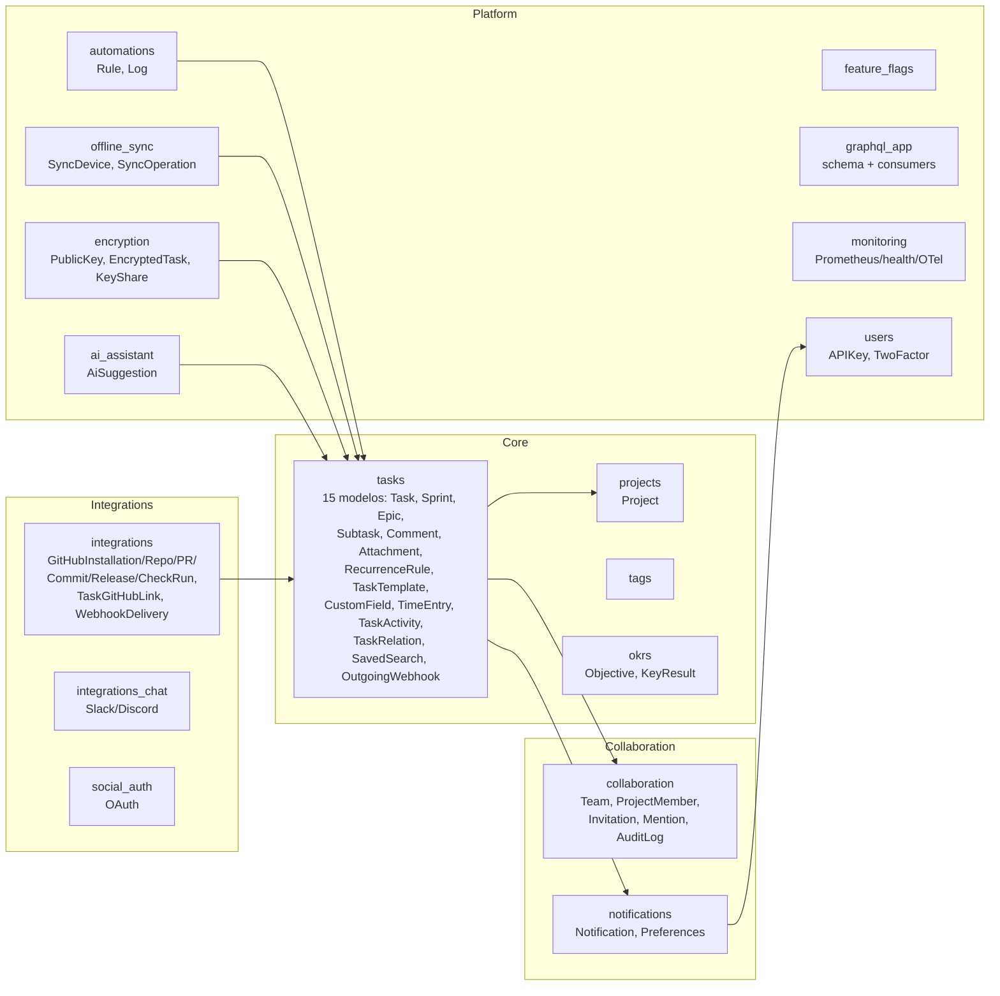
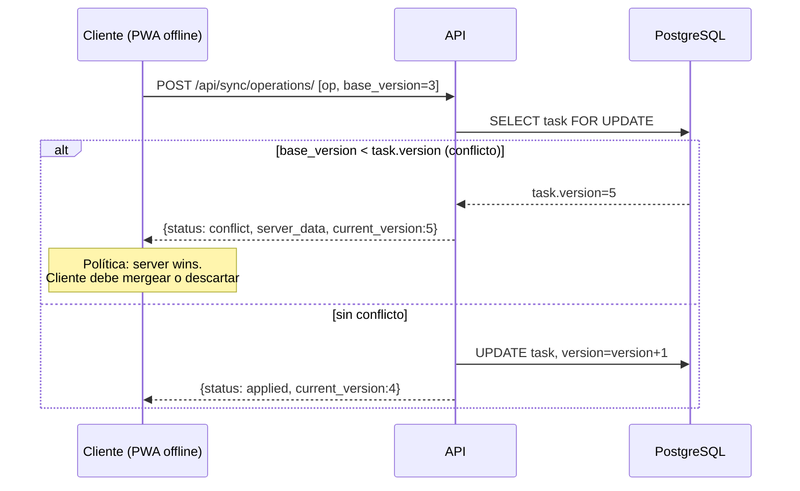
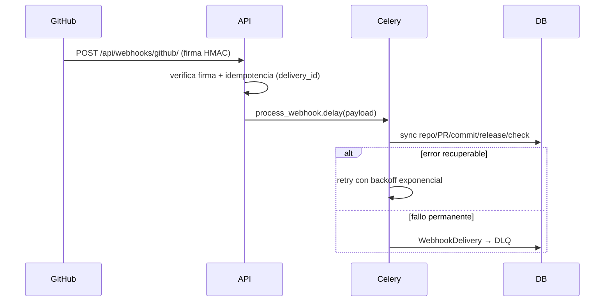
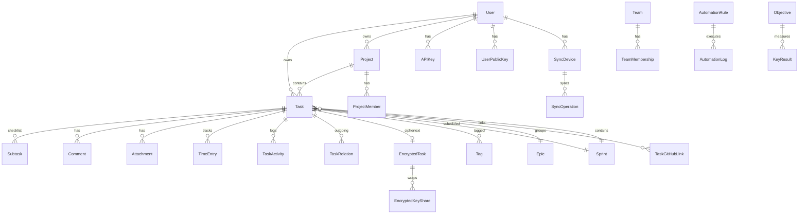

# Arquitectura — TODOlist

## 1. Contexto (C4 nivel 1)

## 2. Contenedores (C4 nivel 2)

## 3. Mapa de dominios (17 apps)

## 4. Secuencia: sync offline con conflicto

### Política de resolución de conflictos

| Caso | Resolución | Quién gana |
|---|---|---|
| Update con `base_version` desactualizada | `conflict` + `server_data` | **Servidor** (last-write-wins implícito: el cliente decide si reintenta) |
| Update sin `base_version` | `rejected` | n/a — se exige para detección |
| Delete con versión desactualizada | `conflict` + `server_data` | **Servidor** |
| Dos usuarios editan campos distintos | Field-level: el último write pisa todo el recurso (no hay merge por campo) | Último que sincroniza |
| `SyncDevice` revocado | Ops rechazadas | Servidor |

La resolución manual queda del lado del cliente: al recibir `conflict` con `server_data`, la PWA muestra el diff y permite reintentar con la nueva `base_version` o descartar la operación local.

## 5. Flujo: webhook GitHub

## 6. ERD (dominios principales)

## 7. Decisiones arquitectónicas (ADRs)

| # | Decisión | Contexto | Trade-off |
|---|---|---|---|
| 1 | Monolito modular | 17 apps, un proceso | Simplicidad de deploy vs acoplamiento; límites por app |
| 2 | JWT en cookies httpOnly | SPA + CSRF | Bearer para API clients; double-submit CSRF |
| 3 | SQLite en tests, Postgres en prod | Velocidad CI | Vendor-checks en código (FTS, índices) |
| 4 | E2E encryption opt-in | Feature flag | Server no indexa contenido cifrado (no FTS/IA sobre él) |
| 5 | Conflict resolution: server wins + client merge | Offline-first | Simplicidad; pierde writes intermedios |
| 6 | tasks como god-app | Dominio cohesionado | 15 modelos acoplados; candidato a split futuro |
| 7 | REST + GraphQL | Diversidad de clientes | Doble superficie: documentación/tests ×2 |
| 8 | Mutation testing por app | mutmut 3.x + fork | Orquestador propio, `-p no:django` |
| 9 | Idempotencia webhooks por delivery_id | GitHub retries | DLQ para fallos permanentes |
| 10 | `-p no:django` en mutmut | Fork-safety de pytest-django | Bootstrap manual en conftest |
